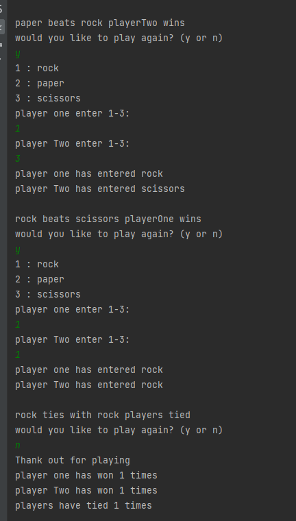
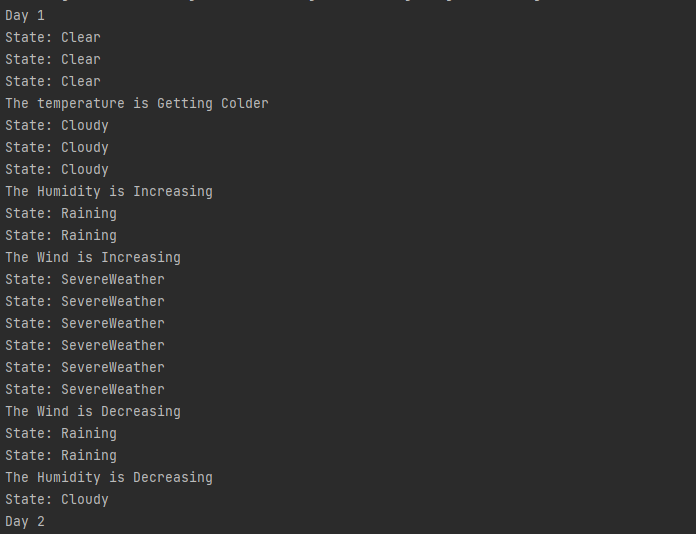
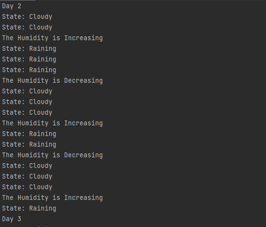
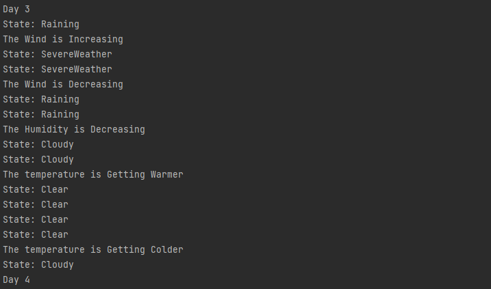
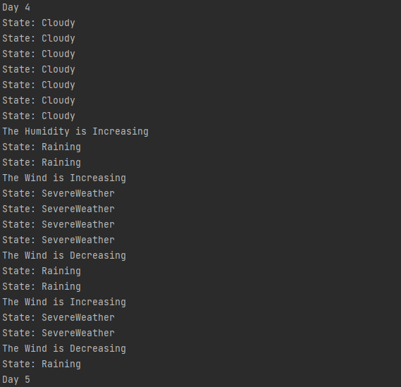
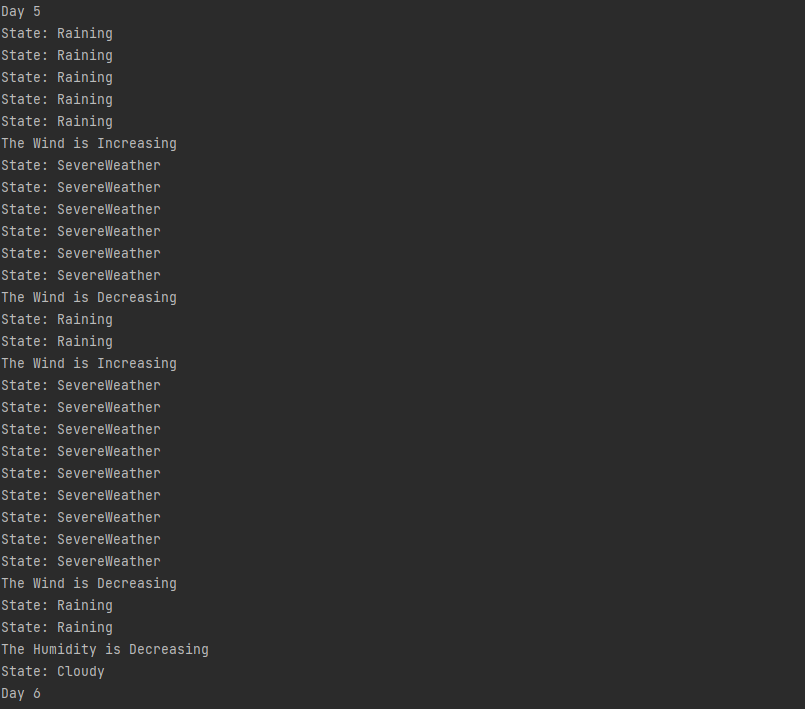
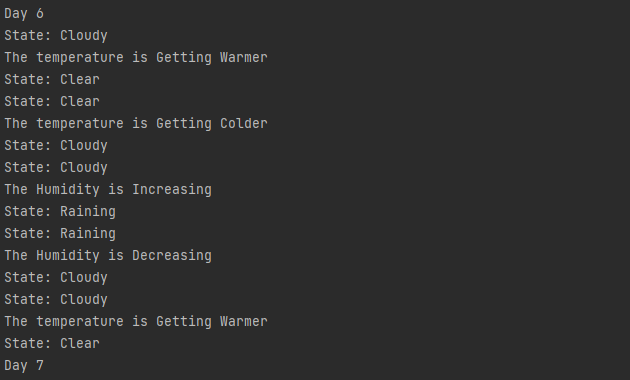
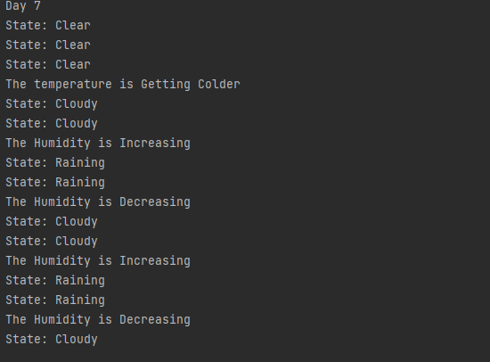

# Herzing-SE1
## GitHub repo for Herzing Software Engineering 1

Unit one

  
##### Image of commandline Rock , paper , Scissers game.

Unit Two

  
### this project is about creating an FSM and using it to simulate 7 days of weather with 5 event changes each day.
3 options for weather to follow a list left right and none.
the list of states was  Clear <-> Cloudy <-> Raining <-> Severe Weather  
with transitions between weather states:
[Getting Warmer, Getting Colder, Humidity is Increasing, Wind is Increasing}
#### running Unit2/src/Main gets the resulting output  
##### Images of commandline weather cycle Finite State Machine. 

Day one

Day Two

Day Three

Day Four

Day Five

    

Day Six

Day Seven

